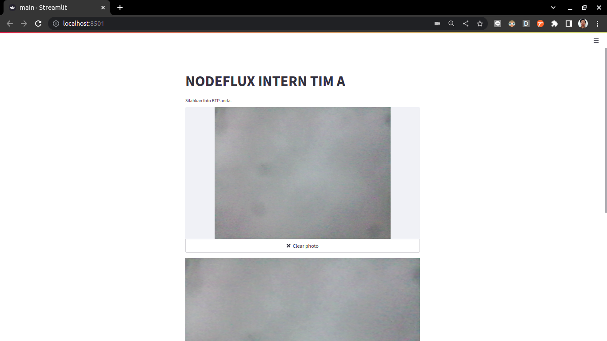
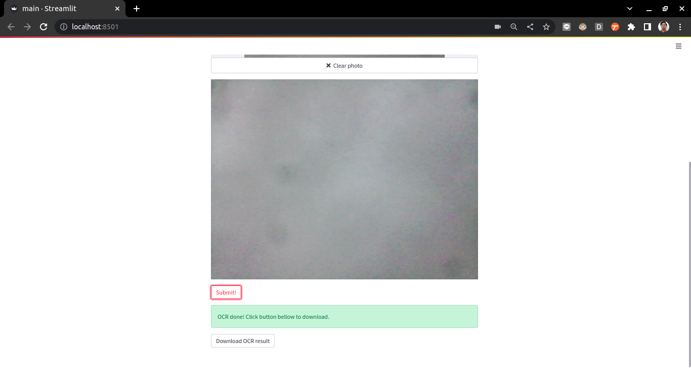

# streamlit-tima-nodeflux




# Quick Start

1. Install requirements.txt.
   ```
   pip3 install -r requirements.txt
   ```
2. Run streamlit.
   ```
   streamlit run main.py
   ```
3. It's running on `http://localhost:8501/`

# Quick Start With Docker

1. Build image.
   ```
   docker build -t mystreamlit .
   ```
2. Run container and map port 8501.
   ```
   docker run \
      -p 8501:8501\
      --rm \
      --name mystreamlit_container \
      mystreamlit
   ```
3. It's running on `http://localhost:8501/`
